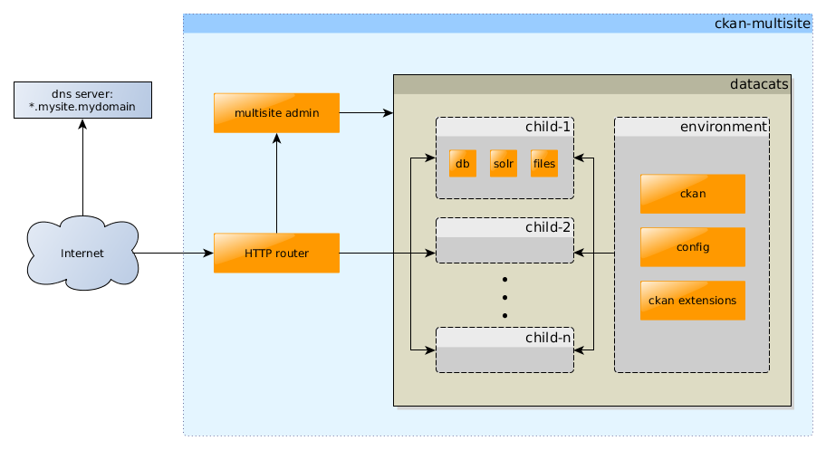

# ckan-multisite
Administrator interface and tools for managing CKAN Data Catalogs

(under development)



ckan-multisite includes three main components:

1. HTTP router
2. Multisite admin
3. [datacats](https://github.com/boxkite/datacats)

To use this project you must have a wildcard domain configured
e.g. `*.mysite.mydomain` that will route visitors to your server.
For development you may add static entries in your /etc/hosts file.

## HTTP router

ckan-multisite includes nginx configuration that will route incoming
connections on port 80 to the multisite admin application or to one
of many CKAN sites on the same server.

## multisite admin

The multisite admin application is a flask application that may be
used to:

1. create ckan instances
2. remove ckan instances
3. reset admin passwords

These are implemented by using
[datacats](https://github.com/boxkite/datacats)
as a library to manage all the necessary docker containers
and issue commands within those containers

## datacats environment

The default datacats environment includes many of the common ckan
extensions and a safe default configuration. This same environment
is used for all CKAN sites created by ckan-multisite.

You may replace the configuration, and extensions on your server
with a new datacats environment that suits your organization's needs.

For more information about using datacats environments, see the
[datacats documentation](http://docs.datacats.com/).

## Setup

For best results, all of the steps below should ideally be run in a fresh Ubuntu
virtual machine.

Docker must be installed to use this application. This application will not work
with the versions of Docker from the Ubuntu (and the majority of distributions)
because they are too outdated. Please follow the installation instructions for
Docker on [the docker site](https://docs.docker.com/installation/).

Before beginning the installation, there are a couple of packages which
ckan-multisite requires of the system it is running of. To get these installed
on an Ubuntu machine you can run the following command:

``` sudo apt-get install nginx redis-server ```


The default nginx and redis configurations should be fine for local development,
but it is advisable to edit the default rule for nginx so that it doesn't allow
access to your administrative interface to anyone. The suggested method of
authentication method is using HTTP authorization. In addition, you should make
the redis server's port unavailable to the outside or use a master password.

If you wish to run the redis distribution as a non-privelleged user, there is
a pre-prepared configuration in the root of the repository. When running the
redis server run it like: ``redis-server ./redis.conf`` (this is already handled
in the provided script).


This application uses setuptools and pip to manage its dependencies. To install
dependencies and the application itself run the following two commands
(preferably in a virtualenv):

```
pip install -r requirements.txt
python setup.py install
```

To run the server, run the ``run.sh`` script in the root directory of this
repository. It accepts an argument ``prod`` which will run it using uwsgi.

## License

This software is licensed under the MIT license, but incorporates
software from boxkite (datacats) and Open Knowledge (ckan)
which are released under the terms of the AGPLv3 license.
